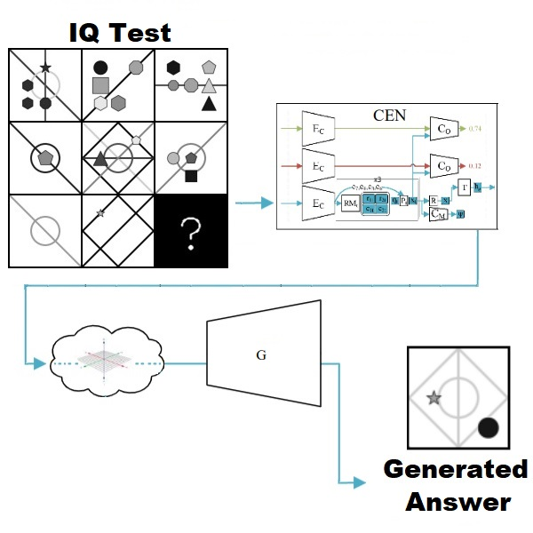

# Generating-Correct-Answers-for-Progressive-Matrices-Intelligence-Tests
code for the paper "Generating Correct Answers for Progressive Matrices Intelligence Tests" to appear in NeurIPS 2020. 

(Niv Pekar,Yaniv Benny, Lior Wolf, 2020)

## Requirements
* python 3.6
* NVIDIA GPU with CUDA 10.0+ capability
* numpy, scipy, matplotlib
* torch==1.4.0
* torchvision==0.5.0
* scikit-image

## Data
* [PGM](https://github.com/deepmind/abstract-reasoning-matrices)
* [RAVEN-FAIR](https://github.com/yanivbenny/RAVEN_FAIR) (Balanced version of RAVEN)

## Code
Code and models will be uploaded soon.

## Acknowledgement
* [Wild Relational Network (WReN](https://github.com/Fen9/WReN)
* [Logic Embedding Network (LEN)](https://github.com/zkcys001/distracting_feature)
